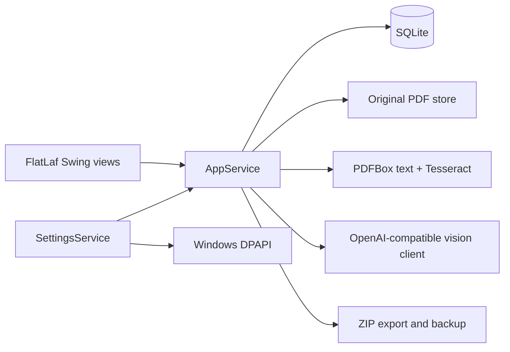

# InvoiceManage 1.1 — System Design

- **Platform:** Windows 10/11 app image, Java 21 desktop application. The Java source and core data services remain portable.
- **Working directory:** `D:/program/InvoiceManage`.
- **Data directory:** `%LOCALAPPDATA%/LocalInvoiceManager` by default; `--data-root=` overrides it for testing.
- **Primary workflow:** import PDF → inspect fields → choose owner and reimbursement month → confirm review → view and export monthly totals.

## Architecture

`MainWindow` owns navigation; `ReimbursementPanel`, `PoolPanel`, and `PeoplePanel` own their views. `AppService` applies business rules. `Database` stores people, invoices, and recent owners. `RecognitionService` handles local extraction. `OpenAiVisionRecognition` makes one optional Chat Completions request for the first two PDF pages. `SettingsService` owns AI configuration. `ExportService` and `BackupService` stay independent of recognition.

FlatLaf Dark supplies consistent controls and tables. The shell uses a dark sidebar, section header, and vector icons drawn in Java2D, so there are no raster assets or external theme files. The sidebar has reimbursement, invoice pool, people, and options actions; the Settings menu also opens the options panel. The `PeoplePanel` dropdown presents eight illustrated avatar presets generated by `AvatarPresets`. New people store a `preset:<id>` token in the existing `person.avatar_path` column. Old uploaded avatar paths remain readable, but the editor offers presets only.

## Data and compatibility

The SQLite schema remains at `user_version=1`; no data migration is required. Existing invoice records, PDF originals, and legacy avatar paths continue to load. Reimbursement month is independent of issue date. New imports have no selected reimbursement month until a user chooses it in the owner picker or invoice editor. A counted invoice requires an owner, month, positive amount, category, and `READY` review status.

For a selected month, `AppService.activePeople(month)` derives owner IDs from the same counted invoice set used by totals and export. The matrix therefore includes a person only when that person has at least one counted invoice in the month, including the fixed Company account when applicable. The matrix's detail popup and ZIP export read that same set.

Invoice originals are copied into `originals/` after SHA-256 duplicate detection. Import never modifies source PDFs. The local database, originals, and avatar directory can be backed up from the Data menu. `settings.properties` is intentionally excluded from backups because it can contain a protected API key.

## AI recognition

The options panel stores `enabled`, full base URL, model name, and API key. An enabled remote endpoint must use HTTPS; HTTP is accepted only for `localhost`, `127.0.0.1`, or `::1`. Redirects are disabled. The client appends `/chat/completions` to the configured base URL and sends Bearer authentication, a JSON instruction, and up to two rendered PDF pages as JPEG data URLs. The request has a 90-second timeout. The endpoint must support OpenAI-compatible Chat Completions vision content. No provider-specific SDK is required.

The response parser reads `choices[0].message.content` as a JSON object. It separates seller/issuer from buyer and traveler, treats amount as the tax-inclusive CNY total, parses dates and integer cents, and maps category to the supported enum. Unreadable or invalid fields remain blank. If an AI result is incomplete, local recognition fills only its missing fields. If the AI request fails, import still completes through local recognition and records `AI_FAILED_LOCAL`. AI-derived records always start as `NEEDS_REVIEW`; they cannot affect totals or exports until a user checks the original and confirms the fields. The context menu can re-run AI recognition on an existing invoice; it preserves owner, month, and original PDF, then returns the record to review.

The key is encrypted at rest on Windows with DPAPI for the current Windows account. On other platforms the key is held only for the current process and AI is disabled after restart until the key is entered again. The settings file and backups never contain a plaintext key. Neither errors nor import reports include the key or server response body.

## Packaging and limitations

Maven produces a shaded JAR. `jpackage --type app-image` creates a Windows directory with its own Java runtime. The app image contains `tessdata/` next to the JAR for offline Chinese and English OCR. A ZIP of the image is the distribution artifact; no global Java or Maven installation is required for end users. Windows code signing and an installer are outside this release.

Recognition covers PDF files up to 25 MB and 25 pages. AI examines the first two pages; later pages are not sent. Model outputs remain fallible, and different OpenAI-compatible providers may vary in vision support and response format. The app does not verify invoice authenticity with tax authorities. The shipped tests use synthetic invoices and a local HTTP mock; acceptance against a representative real invoice corpus remains necessary before relying on recognition accuracy.

## Verification

Run `mvn test` and `mvn package` from the project root with JDK 21 and Maven 3.9+. Tests cover local parsing, railway layouts, duplicate detection, assignment and month changes, monthly export naming, backup/restore, UI initialization, DPAPI key protection, HTTPS validation, and a mocked multimodal request including JPEG payload, Bearer header, seller, amount, date, and category. The UI smoke test runs on a visible desktop. Release verification also launches the packaged EXE with a temporary data root and checks the three views and Options panel.
