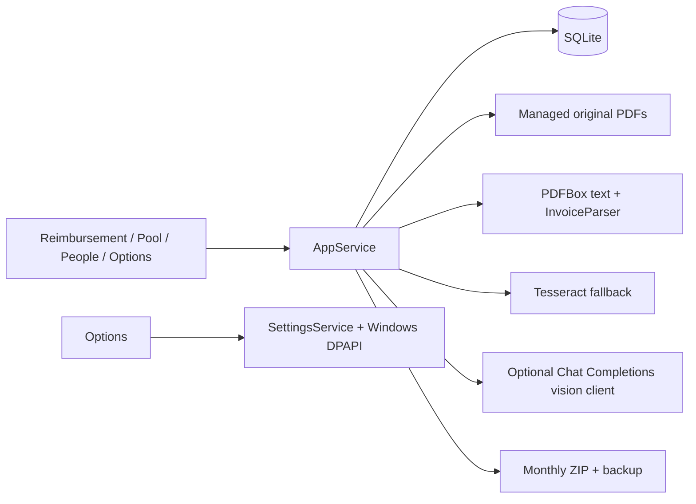

# InvoiceManage 1.2 — System Design

## Scope and runtime

InvoiceManage is a single-user Java desktop application for Chinese PDF invoices and monthly reimbursements. Source and builds stay in `D:/program/InvoiceManage`; business data remains under `%LOCALAPPDATA%/LocalInvoiceManager` unless `--data-root=` is supplied. Swing with FlatLaf Dark provides the interface. SQLite stores metadata, and original PDFs are copied into a managed folder without changing source files.

The application is compiled with the installed JDK 25 and targets Java 21 bytecode. The Windows ZIP contains a shaded application JAR, OCR language data, and `InvoiceManager.cmd`. It does **not** contain a Java runtime. The launcher finds `jdk-25*` under `D:/Program Files/Java` and starts `javaw.exe` with native access enabled for SQLite and OCR libraries. Other operating systems may run the JAR with a compatible installed JDK and OCR native libraries.

## Components and data flow

`AppService` coordinates import, assignment, recognition, review, totals, and export. `RecognitionService` first reads embedded PDF text. `InvoiceParser` handles ordinary and railway layouts, including side-by-side buyer/seller labels and tax-inclusive totals displayed after an uppercase Chinese total. Tesseract handles scans and incomplete text extraction. `OpenAiVisionRecognition` optionally sends up to two rendered pages as JPEG data URLs to the configured OpenAI-compatible `/chat/completions` endpoint. A successful AI result is still marked `NEEDS_REVIEW`; if AI fails on import, local recognition provides a draft and the pool reports the fallback. The original PDF is never rewritten.

The pool right-click menu includes **AI 识别发票**. If AI is not enabled, it opens Options. After confirmation, recognition runs on a background worker, updates recognized fields while preserving owner, reimbursement month, and original file, then opens the invoice editor for manual review. The API key is protected with Windows DPAPI and is excluded from backups. The application never sends invoice pages to a provider unless the user enables AI and starts an import or AI recognition action.

## Monthly state and correctness

`assignedInMonth(month)` includes every invoice with an owner and that reimbursement month, regardless of review state. `activePeople(month)` derives rows from this set, so a person with four assigned pending invoices appears in the matrix. The matrix shows **已归属** and **待核对** counts; clicking either count or a category opens invoice details, including pending records.

`countedInMonth(month)` is deliberately narrower: an invoice contributes to confirmed category amounts, row totals, grand totals, and ZIP export only when it has an owner, month, positive amount, category, and `READY` review status. This keeps provisional OCR or AI amounts visible for review without treating them as approved reimbursements. Changing owner, month, or review state updates the matrix on refresh. The fixed Company account follows the same rule.

The database schema remains version 1. Preset avatars use `preset:<id>` in the existing avatar column, preserving readability of legacy uploaded-avatar paths. `AvatarPresets` renders 16 code-generated portraits with varied expressions, hair, and gestures. No external avatar images or upload workflow are required.

## Verification and limits

The JDK 25 build runs 23 tests, including a read-only regression against the supplied real restaurant invoice. That sample verifies seller/buyer separation, ¥468.00 tax-inclusive total, the 2026-09-12 issue date, invoice number, and dining category. A local mock verifies that the real PDF is rendered into the AI request payload and that an OpenAI-compatible response is parsed; no production AI endpoint is contacted in automated tests. A UI regression verifies four pending invoices display as four assigned and four pending while the confirmed total remains ¥0.00.

AI recognition quality depends on the configured model and the source document. The first two pages are sent; later pages are not. PDF input is limited to 25 MB and 25 pages. The app does not validate invoice authenticity with tax authorities. Monthly export includes confirmed originals only. Backup and export ZIP files are not encrypted and should be handled as sensitive records.
